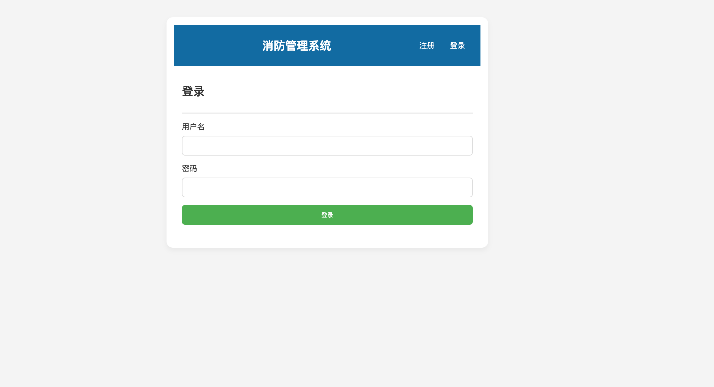
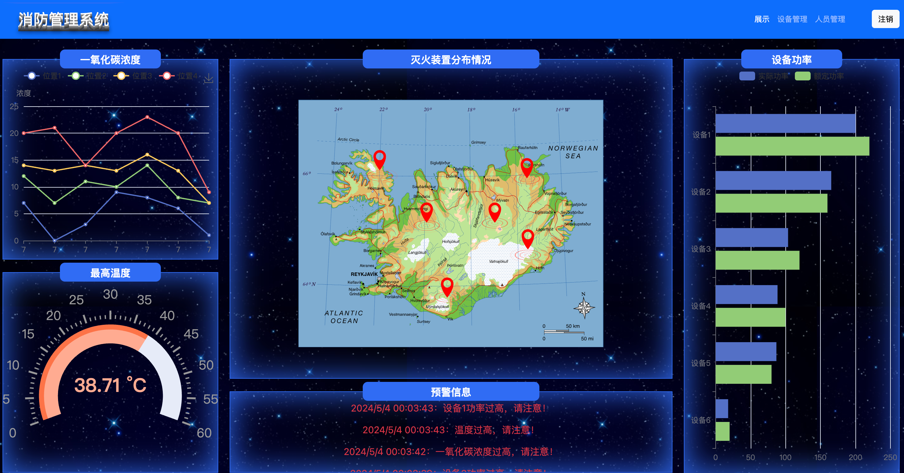
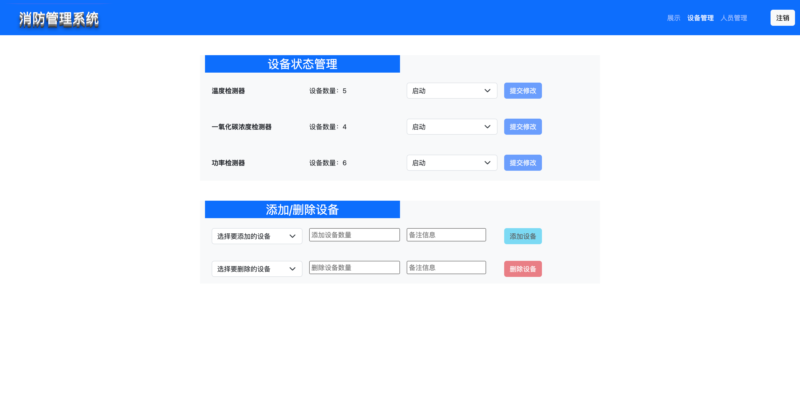
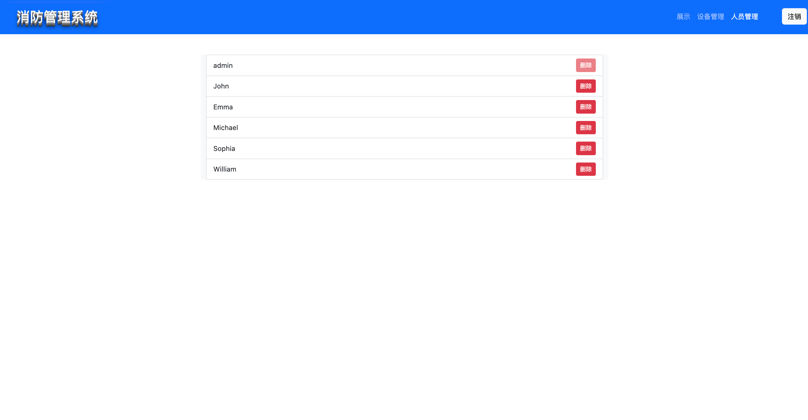

## 简要介绍
前后端不分离的项目，主要技术栈：
数据库：sqlite3
后端：flask 框架
前端：html+css+js+bootstrap
大屏展示：Echarts

### 登录注册界面界面
直接对着 flask 的官方教程梭哈的，就改了一下样式：


### 大屏展示
直接参考的 Echart 官方示例：


### 设备管理模块
这块儿页面简单，基本上都是 bootstrap 的。逻辑基本都加了，增加/删除上下限，和大屏的互动等。


### 人员管理模块
这块儿比较懒，直接只有叫`admin`的账号才是管理员，只有他能看到人员管理模块。然后可以删除自己之外的账号。


## 使用方法
### 初始化数据库
```bash
flask init-db
```

```bash
flask run --port 8000
```
